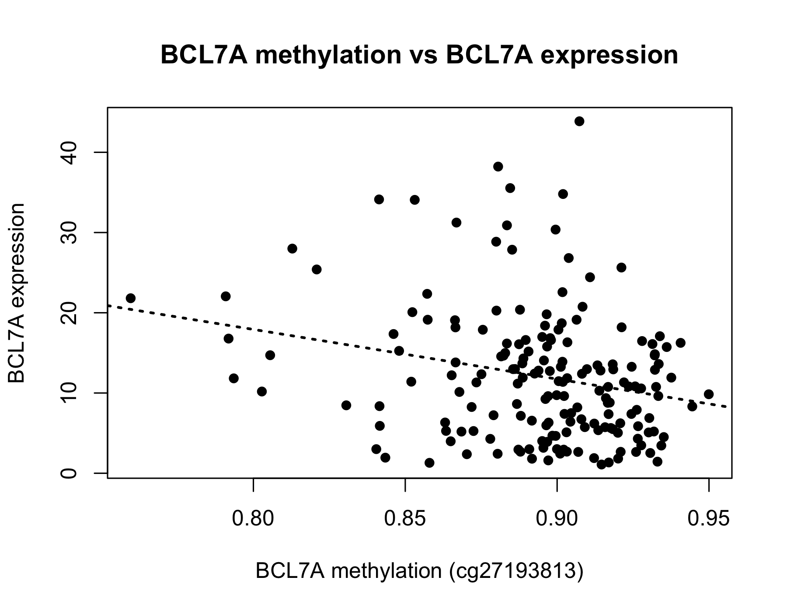

# Reproduction of BCL7A Methylation–Expression Association in TCGA-LAML

## Overview

This project independently reproduces the TCGA-LAML methylation–expression analysis reported by Patiño-Mercau et al. (2023), *BCL7A is silenced by hypermethylation to promote acute myeloid leukemia* (PMID: 36941700), using R/RStudio.

## Research Question

Does DNA methylation at CpG sites within ±400 bp of the BCL7A genomic region show an inverse relationship with BCL7A expression in TCGA-LAML?

## Key Findings

- **176 matched TCGA-LAML patients** were integrated across DNA methylation and RNA expression datasets.
- Of 22 initially identified BCL7A-associated CpGs, **21 were evaluated** after excluding cg20260559 because of missing data.
- **cg27193813** showed the strongest inverse association with BCL7A expression:
  - Pearson correlation: **r = -0.2425**
  - P-value: **p = 0.00118**
  - BH-adjusted FDR: **0.02485**
  - Genomic coordinate: **chr12:122,492,914**



## Genomic Context

The BCL7A region was inspected using the UCSC Genome Browser, including H3K4me1, H3K27ac, and DNase cluster tracks. The CpG site cg27193813 (chr12:122,492,914) is located within intron 5 of BCL7A transcript NM_001024808.3. The H3K4me1 and H3K27ac signal tracks appear as thin lines that overlap the baseline, with no prominent peaks visible in the inspected region. These tracks provide genomic context but do not establish that methylation causes changes in BCL7A expression.


## Limitations

- This project reproduces the TCGA-LAML methylation–expression analysis, not every experiment in the original publication.
- The analysis used 176 matched patients, compared with 160 in the original study.
- The observed association does not establish causality.

## Reproducibility

The repository contains the R analysis workflow, processed result tables, and generated figures. Raw TCGA data are not included.

## Repository Structure

```text
AML_BCL7A/
├── BCL7A/
│   ├── 1.RNA.expression.Rmd
│   ├── 2.DNA.methylation.Rmd
│   ├── 3.matched IDs.Rmd
│   ├── 4.Combine.Rmd
│   ├── 5.Corelation.Rmd
│   ├── 6.Annotation.Rmd
│   ├── 7.visualization.Rmd
│   ├── figures/
│   ├── results/
│   └── Readme.R
├── README.md
└── .gitignore
```

## Project Purpose

This independent computational project was developed to practice cancer genomics, DNA methylation and RNA expression integration, patient matching, correlation analysis, multiple-testing correction, genomic visualization, and reproducible analysis in R.

## Reference

Patiño-Mercau, S., et al. (2023). *BCL7A is silenced by hypermethylation to promote acute myeloid leukemia*. PMID: 36941700.

## Author

**Sibgha Mubeen**
